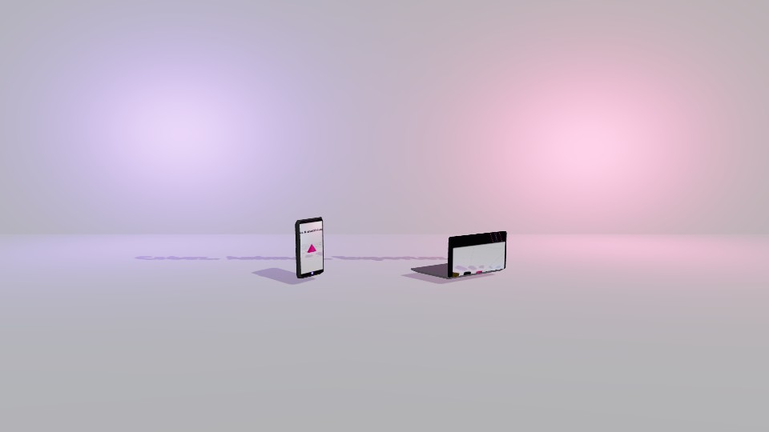

<div align="center">
  

  <h1>MyMotionDesignStudio</h1>

  <p><strong>A free, open-source, offline-first 2D &amp; 3D motion design editor that runs entirely in your browser.</strong></p>

  <p>
    <a href="LICENSE"></a>
    <a href="CONTRIBUTING.md"></a>
    <a href="CODE_OF_CONDUCT.md"></a>
    
    
    
    
  </p>

  <p>
    <a href="#-english">🇬🇧 English</a> ·
    <a href="#-français">🇫🇷 Français</a>
  </p>
</div>

---

## 🇬🇧 English

> **Note:** the application's UI and in-app documentation are **French only** at the moment (see [Internationalization](CONTRIBUTING.md#internationalization)). This README is bilingual — the sections below are in English; jump to the [French version](#-français) further down.

### Table of contents

- [Overview](#overview)
- [Screenshots](#screenshots)
- [Features](#features)
- [Tech stack](#tech-stack)
- [Getting started](#getting-started)
- [Available scripts](#available-scripts)
- [Project structure](#project-structure)
- [Data & privacy](#data--privacy)
- [Testing](#testing)
- [Browser support](#browser-support)
- [Deployment](#deployment)
- [Roadmap & known limitations](#roadmap--known-limitations)
- [Contributing](#contributing)
- [Code of Conduct](#code-of-conduct)
- [License](#license)
- [Acknowledgments](#acknowledgments)

### Overview

**MyMotionDesignStudio** is a WYSIWYG motion design editor for the web: create animated 2D scenes (shapes, text, images) or fully 3D scenes (primitives, imported glTF/OBJ models, PBR materials, lights, cameras), animate them with a keyframe/easing engine, chain multiple scenes with transitions, and export the result as a video (MP4/WebM/GIF/MOV) — all without installing anything or creating an account.

It's built as an **offline-first Progressive Web App**: install it once, and it keeps working — editing and exporting video — with no network connection. All project data lives locally in the browser (IndexedDB); there is no backend, no server-side rendering, and no telemetry.

This project started as a personal/portfolio build and is now open-sourced under the MIT license — see [Contributing](#contributing) if you'd like to help improve it.

### Screenshots

Frames captured from the app's own exported demo projects:

| 2D scene | 3D scene | 3D — imported model |
|---|---|---|
|  |  |  |

The three source projects behind these are available as `public/demos/*.json` and can be imported straight into the app (Projects page → **Importer**) to explore them yourself.

### Features

**2D mode** (Konva-based canvas renderer)
- Vector shapes — rectangle, ellipse, line, polygon (configurable side count), star (configurable branch count) — with fill, stroke, corner radius
- Text layers — font family, weight, size, color, alignment
- Image layers — drag in a file, auto-resized and embedded (base64) into the project
- Per-scene backgrounds — solid color, linear gradient (two colors + angle), or radial color spots on a base color, with a project-level default

**3D mode** (Three.js / react-three-fiber renderer)
- Primitives — box, sphere, cone, cylinder, plane, torus
- Model import — glTF, GLB, and OBJ, embedded into the project
- Extruded 3D text with automatic bevel (accented-character font included)
- PBR materials — color, metalness, roughness, opacity, per-object cast-shadow toggle
- Camera — perspective or orthographic, position/rotation/FOV/near/far, keyframable, free orbit navigation while editing
- Lights, shadows, and the same solid/gradient/spots background system as 2D, rendered via a generated texture
- A separate "reflections" preset (none / city / studio) affecting metallic materials, independent from the background

**Animation & scenes**
- Keyframe-based animation engine with linear, ease-in/out/in-out, and spring easing
- Multi-scene projects — reorder scenes by drag, rename inline, per-scene duration
- Transitions between scenes — fade, slide, zoom, dissolve, wipe — with duration and easing

**Project & export**
- Project settings (format/aspect ratio, FPS, background, environment, shadows, default scene duration) editable at any time, not just at creation
- Client-side video export (MediaRecorder-based) to MP4, WebM, GIF, or MOV, with resolution presets up to 4K, quality/bitrate presets, progress reporting, and cancellation
- Auto-generated project thumbnail after a successful export
- JSON export/import for backup, sharing, or moving a project to another device
- Undo/redo history (50 steps) and debounced autosave to the browser's local database
- Installable PWA with full offline support once loaded once
- Light and dark theme across the entire app

### Tech stack

| Layer | Technology |
|---|---|
| Framework | [React 19](https://react.dev/) + [TypeScript](https://www.typescriptlang.org/) |
| Build tool | [Vite](https://vitejs.dev/) + [vite-plugin-pwa](https://vite-pwa-org.netlify.app/) (Workbox) |
| Routing | [React Router](https://reactrouter.com/) |
| State management | [Zustand](https://github.com/pmndrs/zustand) |
| 2D rendering | [Konva](https://konvajs.org/) / [react-konva](https://github.com/konvajs/react-konva) |
| 3D rendering | [Three.js](https://threejs.org/) / [react-three-fiber](https://docs.pmnd.rs/react-three-fiber) / [drei](https://github.com/pmndrs/drei) |
| Local persistence | [IndexedDB](https://developer.mozilla.org/en-US/docs/Web/API/IndexedDB_API) via [Dexie.js](https://dexie.org/) |
| Styling | [Tailwind CSS](https://tailwindcss.com/) |
| Icons | [lucide-react](https://lucide.dev/) |
| Video export | [MediaRecorder API](https://developer.mozilla.org/en-US/docs/Web/API/MediaRecorder) |

### Getting started

**Prerequisites:** [Node.js](https://nodejs.org/) `20.19+` or `22.12+` (required by Vite 8), and npm.

```bash
# Clone the repository
git clone https://github.com/rodolphe37/my-motion-design-studio.git
cd my-motion-design-studio

# Install dependencies
npm install

# Start the dev server (http://localhost:5173)
npm run dev
```

> The repo currently has both a `package-lock.json` and a `yarn.lock` committed. The workflow above (and this project's own history) uses **npm** — if you prefer Yarn, `yarn install` should also work, but isn't the primary tested path.

### Available scripts

| Command | Description |
|---|---|
| `npm run dev` | Start the Vite dev server with hot module reload |
| `npm run build` | Type-check and produce a production build in `dist/` |
| `npm run preview` | Serve the production build locally, to sanity-check it before deploying |
| `npm run lint` | Run ESLint over the codebase |
| `npm run typecheck` | Run the TypeScript compiler in `--noEmit` mode |

### Project structure

```
src/
├── App.tsx                          # Router setup (all routes)
├── main.tsx                         # Entry point, mounts <App/>
├── index.css                        # Tailwind layers, design tokens, shared component classes
├── components/
│   ├── Header.tsx                   # Shared nav header (Docs / Projects / Settings pages)
│   ├── DemoPlayer.tsx               # Landing-page autoplay preview player
│   ├── NewProjectModal.tsx          # 4-step "new project" creation wizard
│   └── editor/
│       ├── EditorToolbar.tsx        # Top bar: scene tabs, playback, undo/redo, export
│       ├── LeftToolbar.tsx          # Tool palette (2D shapes, or 3D primitives/lights/camera)
│       ├── Canvas2D.tsx             # Konva-based 2D renderer + scene background
│       ├── Canvas3D.tsx             # react-three-fiber 3D renderer, camera, lights, gizmo
│       ├── RightPanels.tsx          # Properties / Layers / Animation / Transitions / Scene panels
│       ├── Timeline.tsx             # Keyframe timeline + playhead
│       ├── ProjectSettingsModal.tsx # Post-creation project settings
│       ├── ExportModal.tsx          # Video export pipeline
│       └── PreviewMode.tsx          # Fullscreen scene-by-scene preview
├── pages/
│   ├── LandingPage.tsx              # Public marketing page ("/")
│   ├── DocsPage.tsx                 # In-app documentation ("/docs")
│   ├── ProjectsPage.tsx             # Project dashboard ("/projects")
│   ├── SettingsPage.tsx             # App settings — theme, storage, full reset ("/settings")
│   └── EditorPage.tsx               # Editor shell ("/editor/:projectId")
└── lib/
    ├── types.ts                     # Core data model (Project, Scene, Layer, …)
    ├── store.ts                     # Zustand store: state + undo/redo + all mutations
    ├── factories.ts                 # Default-value constructors for new layers/projects
    ├── animation.ts                 # Keyframe interpolation / easing engine
    ├── db.ts                        # Dexie (IndexedDB) wrapper — CRUD for projects
    ├── download.ts                  # Blob/JSON download helpers
    ├── useAutoSave.ts               # Debounced autosave hook
    ├── useKeyboardShortcuts.ts      # Global keyboard shortcut handling
    └── useTheme.ts                  # Light/dark theme persistence
```

### Data & privacy

- **Everything is local.** Projects are stored in the browser's IndexedDB, on the device you're using — there is no backend, no account, no server round-trip for your project data.
- **No telemetry.** The app doesn't ship any analytics or tracking.
- **No cross-device sync.** Since storage is per-browser/per-device, use **Export JSON** / **Import** (Projects page) to move a project to another machine or back it up outside the browser.
- Clearing your browser's site data for this app (or using a different browser/profile) will remove your local projects — export anything you want to keep.

### Testing

There is currently **no automated test suite**. Correctness is verified via `npm run typecheck`, `npm run lint`, `npm run build`, and manual QA in the browser. Adding a test setup (e.g. [Vitest](https://vitest.dev/) + [React Testing Library](https://testing-library.com/), which fit the existing Vite toolchain) is a welcome contribution — see [CONTRIBUTING.md](CONTRIBUTING.md).

### Browser support

- A recent evergreen browser (Chrome, Edge, Firefox, Safari) is expected. **3D mode requires WebGL2.**
- The **project dashboard and the editor are desktop-only** (dense grids, drag targets, and multi-panel layouts aren't adapted to small touch screens) — a dedicated message is shown on narrow viewports. The landing page itself is fully responsive.
- PWA install support varies by browser; it's most complete in Chromium-based browsers.

### Deployment

The app is a static site — `npm run build` outputs a self-contained `dist/` folder deployable to any static host (Netlify, Vercel, Cloudflare Pages, GitHub Pages, etc.). The PWA service worker (via `vite-plugin-pwa`) is generated as part of the build.

### Roadmap & known limitations

A few things that are honestly still missing or rough, in no particular order:

- No automated tests and no CI pipeline yet.
- No internationalization — UI and docs are French only (see [Internationalization](CONTRIBUTING.md#internationalization)).
- The 3D toolbar currently only adds **directional** lights; point/spot/ambient exist in the data model and are fully editable once present, but aren't reachable as a distinct "add" action yet.
- Layer grouping is defined in the data model (`GroupLayer`) but has no creation UI yet — nothing produces a group today.
- No cloud sync or multi-user collaboration — see [Data & privacy](#data--privacy).
- During interactive 3D editing, the on-screen viewport's aspect ratio can differ slightly from the project's target export resolution; the final exported video always renders at the configured resolution regardless.

If you'd like to tackle any of these, please see [Contributing](#contributing) — opening an issue first to discuss approach is appreciated for anything non-trivial.

### Contributing

Contributions are very welcome — bug reports, fixes, features, docs, or design/UX feedback. Please read **[CONTRIBUTING.md](CONTRIBUTING.md)** for the development setup, coding conventions, commit style, and pull request process before opening one.

### Code of Conduct

This project follows the [Contributor Covenant](CODE_OF_CONDUCT.md). By participating, you're expected to uphold it.

### License

Distributed under the **MIT License**. See [`LICENSE`](LICENSE) for the full text.

### Acknowledgments

This project wouldn't exist without these open-source projects:
[React](https://react.dev/), [TypeScript](https://www.typescriptlang.org/), [Vite](https://vitejs.dev/), [vite-plugin-pwa](https://vite-pwa-org.netlify.app/), [Tailwind CSS](https://tailwindcss.com/), [Zustand](https://github.com/pmndrs/zustand), [Dexie.js](https://dexie.org/), [Konva](https://konvajs.org/) / [react-konva](https://github.com/konvajs/react-konva), [Three.js](https://threejs.org/), [react-three-fiber](https://docs.pmnd.rs/react-three-fiber) / [drei](https://github.com/pmndrs/drei), and [lucide-react](https://lucide.dev/).

---

## 🇫🇷 Français

> **Remarque :** l'interface de l'application et sa documentation intégrée sont **exclusivement en français** pour l'instant. Ce README, lui, est bilingue — cette section reprend en français l'essentiel de la section anglaise ci-dessus ; pour les commandes shell et l'arborescence du projet (identiques quelle que soit la langue), on renvoie directement aux blocs déjà donnés plus haut plutôt que de les dupliquer.

### Table des matières

- [Présentation](#présentation)
- [Fonctionnalités](#fonctionnalités)
- [Stack technique](#stack-technique)
- [Démarrage rapide](#démarrage-rapide)
- [Données & confidentialité](#données--confidentialité)
- [Tests](#tests)
- [Navigateurs supportés](#navigateurs-supportés)
- [Déploiement](#déploiement)
- [Feuille de route & limites connues](#feuille-de-route--limites-connues)
- [Contribuer](#contribuer)
- [Code de conduite](#code-de-conduite)
- [Licence](#licence)

### Présentation

**MyMotionDesignStudio** est un éditeur de motion design WYSIWYG qui fonctionne entièrement dans le navigateur : créez des scènes 2D animées (formes, texte, images) ou des scènes 3D complètes (primitives, modèles glTF/OBJ importés, matériaux PBR, lumières, caméras), animez-les avec un moteur de keyframes/easing, enchaînez plusieurs scènes avec des transitions, puis exportez le résultat en vidéo (MP4/WebM/GIF/MOV) — sans rien installer et sans créer de compte.

C'est une **Progressive Web App offline-first** : installez-la une fois, et elle continue de fonctionner — édition et export vidéo compris — sans connexion réseau. Toutes les données de projet vivent localement dans le navigateur (IndexedDB) ; il n'y a ni backend, ni rendu côté serveur, ni télémétrie.

Ce projet a démarré comme réalisation personnelle/portfolio et est désormais publié en open source sous licence MIT — voir [Contribuer](#contribuer) si vous souhaitez aider à l'améliorer.

### Fonctionnalités

**Mode 2D** (rendu via Konva)
- Formes vectorielles — rectangle, ellipse, ligne, polygone (nombre de côtés réglable), étoile (nombre de branches réglable) — avec remplissage, contour, rayon des coins
- Calques texte — police, graisse, taille, couleur, alignement
- Calques image — import par fichier, redimensionné automatiquement et intégré (base64) au projet
- Fond par scène — couleur unie, dégradé linéaire (deux couleurs + angle), ou spots de couleur radiaux sur une couleur de base, avec une valeur par défaut au niveau du projet

**Mode 3D** (rendu via Three.js / react-three-fiber)
- Primitives — cube, sphère, cône, cylindre, plan, tore
- Import de modèles — glTF, GLB et OBJ, intégrés au projet
- Texte 3D extrudé avec biseau automatique (police couvrant les caractères accentués)
- Matériaux PBR — couleur, metalness, roughness, opacité, ombre portée réglable par objet
- Caméra — perspective ou orthographique, position/rotation/FOV/near/far, animable par keyframes, navigation libre à l'orbite pendant l'édition
- Lumières, ombres, et le même système de fond uni/dégradé/spots qu'en 2D, rendu via une texture générée
- Un préréglage de « reflets » séparé (aucun / ville / studio) affectant les matériaux métalliques, indépendant du fond

**Animation & scènes**
- Moteur d'animation par keyframes avec easing linéaire, ease-in/out/in-out et spring
- Projets multi-scènes — réordonnables par glisser-déposer, renommables directement, durée par scène
- Transitions entre scènes — fondu, glissement, zoom, dissolve, wipe — avec durée et easing

**Projet & export**
- Réglages du projet (format/ratio, FPS, fond, environnement, ombres, durée par défaut d'une scène) modifiables à tout moment, pas seulement à la création
- Export vidéo côté client (via MediaRecorder) en MP4, WebM, GIF ou MOV, avec préréglages de résolution jusqu'à la 4K, préréglages de qualité/débit, suivi de progression et annulation
- Miniature de projet générée automatiquement après un export réussi
- Export/import JSON pour sauvegarder, partager ou transférer un projet vers un autre appareil
- Historique annuler/rétablir (50 étapes) et enregistrement automatique différé vers la base locale du navigateur
- PWA installable, fonctionnant intégralement hors ligne une fois chargée
- Thème clair et sombre sur l'ensemble de l'application

### Stack technique

Voir le tableau de la section anglaise ci-dessus ([Tech stack](#tech-stack)) — les technologies utilisées sont les mêmes quel que soit le contexte de lecture : React 19 + TypeScript, Vite, React Router, Zustand, Konva, Three.js / react-three-fiber / drei, Dexie.js (IndexedDB), Tailwind CSS, lucide-react, et l'API MediaRecorder pour l'export vidéo.

### Démarrage rapide

**Prérequis :** [Node.js](https://nodejs.org/) `20.19+` ou `22.12+` (exigé par Vite 8), et npm.

Les commandes sont identiques à celles de la section anglaise ([Getting started](#getting-started)) :

```bash
git clone https://github.com/rodolphe37/my-motion-design-studio.git
cd my-motion-design-studio
npm install
npm run dev
```

L'app tourne alors sur `http://localhost:5173`. Voir la table des [scripts disponibles](#available-scripts) plus haut pour `build`, `preview`, `lint` et `typecheck`.

### Données & confidentialité

- **Tout est local.** Les projets sont stockés dans l'IndexedDB du navigateur, sur l'appareil utilisé — il n'y a ni backend, ni compte, ni aller-retour serveur pour vos données de projet.
- **Aucune télémétrie.** L'application n'embarque aucun outil d'analyse ou de tracking.
- **Pas de synchronisation multi-appareil.** Le stockage étant local au navigateur/appareil, utilisez **Exporter JSON** / **Importer** (page Mes projets) pour transférer un projet ou le sauvegarder ailleurs.
- Vider les données de site de ce navigateur (ou changer de navigateur/profil) supprime vos projets locaux — pensez à exporter ce que vous voulez conserver.

### Tests

Il n'existe actuellement **aucune suite de tests automatisés**. La fiabilité est vérifiée via `npm run typecheck`, `npm run lint`, `npm run build`, et des tests manuels dans le navigateur. Mettre en place des tests (par exemple [Vitest](https://vitest.dev/) + [React Testing Library](https://testing-library.com/), qui s'intègrent bien à la stack Vite existante) est une contribution bienvenue — voir [CONTRIBUTING.md](CONTRIBUTING.md).

### Navigateurs supportés

- Un navigateur récent à jour (Chrome, Edge, Firefox, Safari) est attendu. **Le mode 3D nécessite WebGL2.**
- **La page Mes projets et l'éditeur sont réservés au bureau** (grilles denses, glisser-déposer, panneaux multiples non adaptés au tactile/petit écran) — un message dédié s'affiche sur les écrans étroits. La page d'accueil, elle, est entièrement responsive.
- Le support d'installation PWA varie selon le navigateur ; il est le plus complet sur les navigateurs à base Chromium.

### Déploiement

L'application est un site statique — `npm run build` génère un dossier `dist/` autonome, déployable sur n'importe quel hébergeur statique (Netlify, Vercel, Cloudflare Pages, GitHub Pages, etc.). Le service worker PWA (via `vite-plugin-pwa`) est généré automatiquement lors du build.

### Feuille de route & limites connues

Quelques points honnêtement encore manquants ou perfectibles, sans ordre particulier :

- Pas encore de tests automatisés ni de pipeline CI.
- Pas d'internationalisation — l'interface et la documentation sont exclusivement en français (voir [Internationalization](CONTRIBUTING.md#internationalization)).
- La barre d'outils 3D n'ajoute aujourd'hui que des lumières **directionnelles** ; les types point/spot/ambiante existent dans le modèle de données et sont pleinement éditables une fois présents, mais ne sont pas encore accessibles comme action d'ajout dédiée.
- Le regroupement de calques existe dans le modèle de données (`GroupLayer`) mais n'a pas encore d'interface de création — rien ne produit de groupe aujourd'hui.
- Pas de synchronisation cloud ni de collaboration multi-utilisateur — voir [Données & confidentialité](#données--confidentialité).
- Pendant l'édition 3D interactive, le ratio d'aspect du viewport à l'écran peut différer légèrement de la résolution cible d'export du projet ; la vidéo exportée, elle, est toujours rendue à la résolution configurée.

Si vous souhaitez vous attaquer à l'un de ces points, voir [Contribuer](#contribuer) — ouvrir une issue au préalable est apprécié pour tout ce qui n'est pas trivial.

### Contribuer

Les contributions sont les bienvenues — rapports de bugs, corrections, fonctionnalités, documentation, ou retours design/UX. Merci de lire **[CONTRIBUTING.md](CONTRIBUTING.md)** (en anglais) pour la configuration de développement, les conventions de code, le style de commit et le processus de pull request avant d'en ouvrir une.

### Code de conduite

Ce projet suit le [Contributor Covenant](CODE_OF_CONDUCT.md) (en anglais). En y participant, vous êtes tenu de le respecter.

### Licence

Distribué sous **licence MIT**. Voir [`LICENSE`](LICENSE) pour le texte complet.
